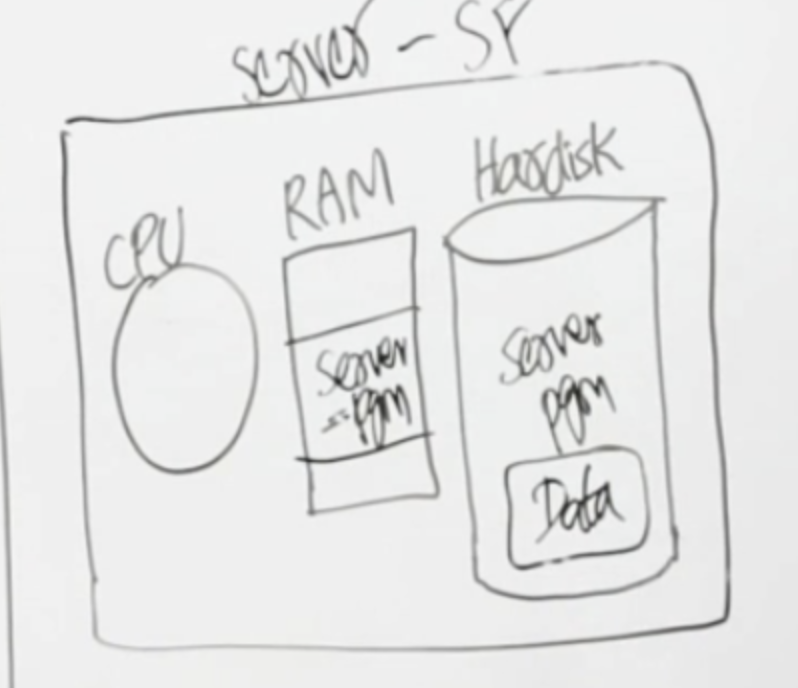
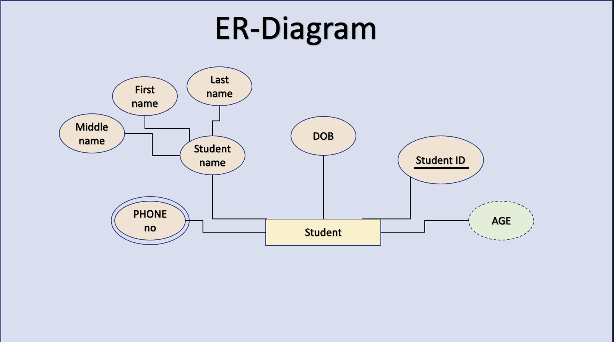
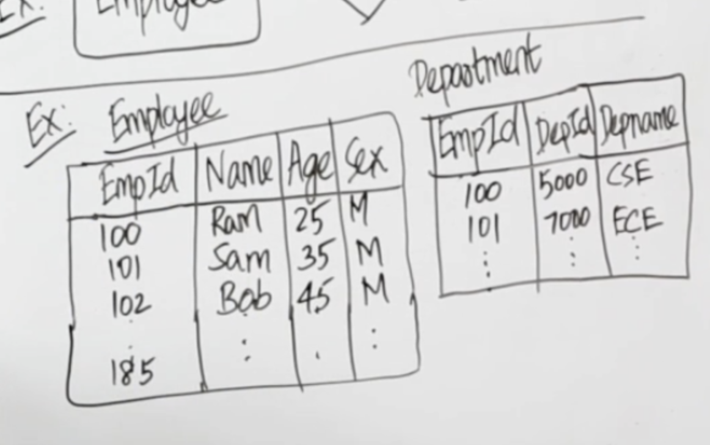

# SQL DATABASE Notes: 

-> Data:
* Any fact that can be stored or record.

-> DataBase:
* Collection of data.

-> DataBase Management System(DBMS):
* Software used to Costruct, Manipulate and retrieve the data is known as DBMS.

-> DataBase Software:
* <(Program + Data )> Management software like Oracle, MySQL etc.

-> Server Client:
* Computer which have the       software of server.
* Serves milloins of clients.

* Client is basically a user which is using our database.

# Diagram:
  

 
 
 

# Data Model:

* Used to represent the data in the DataBase.
 
<h3>Types:</h3>

* ER Model -> Diagramatical representation.
* Relational Model.

 

# Entity Relationship Model (ER Model):

<h2>Defination:</h2>

* Entity means the real world objects we see.
* Assosiation between Entities.
* Attributes is the properties of Entities.

<h3>Example:</h3>

 

<h2>Representations in ER Diagram</h2>

* <b>Rectangle</b>: Represents Entity sets.
* <b>Ellipses</b>: Attributes
* <b>Diamonds</b>: Relationship Set
* <b>Lines</b>: They link attributes to Entity Sets and Entity sets to Relationship Set
* <b>Double Ellipses</b>: Multivalued Attributes
* <b>Dashed Ellipses</b>: Derived Attributes
* <b>Double Rectangles</b>: Weak Entity Sets
* <b>Double Lines</b>: Total participation of an entity in a relationship set
<h3>Example:</h3>

 

<h2>Advantages of ER Model: </h2>

* Easy to understand for the naive person.
* It shows the struncture of the DataBase diagramatically.

 

<h2>Diagram of ER Model: </h2>

 

<h2>Diagram of Relational Model: </h2>

 

<h3>Basic terminologies</h3>

* Table or Relation.
* Record or Tuple or Row.
* Column or Attribute or Field.

 

<h1>Classification of Attributes</h1>

<h3>Simple Attributes</h3>

* Cannot divide into further attributes.
* eg, Name Attribute it cannot divide into further attributes.
* but it can be divided if it divides then this will not be the simple Attribute.

<h4>Example in ER</h4>

<h4>Example in Relational</h4>

<h3>Composite Attributes</h3>

* Can be divided further into attributes.
* eg, Name Attribute if it has sub attributes it like; last name, sur name, middle name.
* In such case it can be divided into more attributes this type is composite attributes.

<h4>Example in ER</h4>

<h4>Example in Relational</h4>

<h3>Single valued attributes</h3>

*  the attribute in which it contains only one value.
* eg; AGE of a person can only contain single value because he cannot has two ages.
* we can see that in above table.

<h3>Multi valued attributes</h3>

* the attribute in which it contains more than one value.
* eg; A person can have more than one phone numbers so the phone number attribute is multivalued.
* It is represented with double ovals in an ER Diagram. 

<h3>Stored attributes</h3>

* the attribute which we can store.

<h3>Derived attributes</h3>

* A derived attribute is one whose value is dynamic and derived from another attribute.
* It is represented by dashed oval in an ER Diagram.
* eg; Person age is a derived attribute as it changes over time and can be derived from another attribute (Date of birth).

<h4>Example in ER</h4>

 
 

<h1>Relationship terminologies and types:</h1>

<h3>Relationship:</h3>

* Association between entities is called relationship.
* do not confuse it with relation which is the Table of an entity.
<h3>Example:</h3>

<h3>Degree of the relationship:</h3>

* Number of entites participating in the relationship.
* eg, how many tables are there in a relationship as above example has two,ie; Employee and department.

<h3>Cardinality ratio:</h3>

* ratio of maximum number of relationship an entity can participate in.
* it can be find by the requiremet analysis.

<h3>Requirement analysis:</h3>

* The requirement required to build the data base accordingly depending on thier needs.
* Eg; a student can enroll for any number of courses and a course can have any number of students.
* after analysing the case study the following is the cardinality ratio.

<h2>Cardinality example:</h2>

* So the cardinality ratio is<strong> N : M</strong>

<h3>Participation or Existance:</h3>

* it is the minimum number of relationship an entity can participate in is know as participation.
<h3>Types of participation:</h3>

* Total participation.
* Partial participation.

<h3>Total Participation:</h3>

* if every entity participates in the relationship atleast once,
then we say that the participation of that entity in that relationship is TOTAL.
* In ER-Model we denoted Total participation with double lines.

<h3>Example:</h3>

<h3>Partial Participation:</h3>

* If atleast one entity in the relationship is not present at other entity relationship then it would be the Partial Participation.
* we denote it as single line in a relationship.

<h3>Example:</h3>

